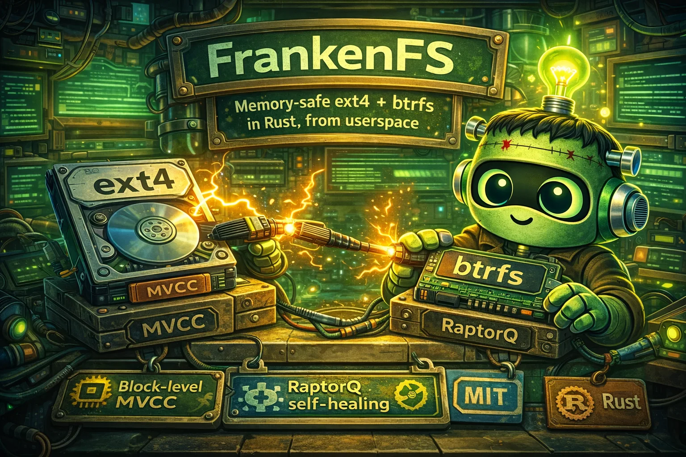

<div align="center">
  
</div>

<p align="center">
  <br>
  <code>&nbsp;╔═╗┬─┐┌─┐┌┐┌┬┌─┌─┐┌┐┌╔═╗╔═╗&nbsp;</code><br>
  <code>&nbsp;╠╣ ├┬┘├─┤│││├┴┐├┤ │││╠╣ ╚═╗&nbsp;</code><br>
  <code>&nbsp;╚  ┴└─┴ ┴┘└┘┴ ┴└─┘┘└┘╚  ╚═╝&nbsp;</code><br>
  <br>
  <strong>Memory-safe ext4 + btrfs in Rust, from userspace</strong><br>
  <em>Block-level MVCC &middot; RaptorQ self-healing &middot; Adaptive conflict arbitration &middot; Zero unsafe code</em>
</p>

<p align="center">
  <a href="https://github.com/Dicklesworthstone/frankenfs/blob/main/LICENSE"></a>
  <a href="https://www.rust-lang.org/"></a>
  
  
  
  
</p>

---

## TL;DR

**The problem:** Linux filesystems are trapped in kernel space. ext4 is 30 years old with a global journal lock (JBD2) that serializes all writes. btrfs has better internals but remains kernel-only, hard to test, and impossible to extend from userspace. Both lack automatic corruption recovery; you run `fsck` after the fact and hope.

**The solution:** FrankenFS extracts the *behavior* of ext4 and btrfs from ~205K lines of Linux kernel C (v6.19) and re-implements it idiomatically in Rust as a FUSE filesystem. The tracked V1 parity matrix is complete, and the current runtime can read real ext4/btrfs disk images and mount both in experimental mode (default read-only, optional `--rw`) while operational hardening continues.

| What | How | Why it matters |
|------|-----|----------------|
| **Block-level MVCC** | Version chains per block, snapshot isolation, adaptive conflict policy (Strict/SafeMerge/Adaptive with expected-loss decision model) | Concurrent readers + writers without the JBD2 global lock. Safe-merge proofs allow non-conflicting concurrent writes to the same block. |
| **RaptorQ self-healing** | Fountain-coded repair symbols (RFC 6330), Bayesian durability autopilot, adaptive refresh (age + block-count hybrid trigger), scrub-and-recover pipeline | Corruption can be detected and repaired via the `ffs repair` / `ffs fsck` CLI path today; background auto-scrub at mount time is implemented in `ffs-repair::ScrubDaemon` and slated to wire into the `ffs mount` path in V1.x (see Limitations). Stale-window SLO monitoring. |
| **Writeback-cache readiness** | Epoch-based commit barriers with per-inode deferred visibility, 12-scenario crash consistency proof | Future FUSE writeback-cache enablement without violating MVCC snapshot isolation or durability guarantees. |
| **Memory safety** | `#![forbid(unsafe_code)]` at every crate root, Rust 2024 edition | Eliminates the buffer overflows and use-after-free bugs that plague kernel C filesystem code. |
| **Userspace FUSE** | Runs as a normal process via FUSE | Debug with standard tools. No kernel module loading. No reboot-on-crash. |

---

## Quick Example

```bash
# Clone and build
git clone https://github.com/Dicklesworthstone/frankenfs.git
cd frankenfs
cargo build --workspace

# Inspect an ext4 image
cargo run -p ffs-cli -- inspect /path/to/ext4.img --json

# Show filesystem superblock + optional detailed sections
cargo run -p ffs-cli -- info /path/to/ext4.img --groups --mvcc --journal --json

# Inspect a btrfs image
cargo run -p ffs-cli -- inspect /path/to/btrfs.img --json

# Run conformance checks against real filesystem images
cargo run -p ffs-harness -- check-fixtures
cargo run -p ffs-harness -- parity

# One-command self-healing adoption wedge (no FUSE, temp raw image)
cargo run --bin ffs-demo -- self-healing

# Full CI gate
cargo fmt --check
cargo check --all-targets
cargo clippy --all-targets -- -D warnings
cargo test --workspace
```

---

## Design Philosophy

### 1. Spec-first, not translation

FrankenFS does **not** translate C line-by-line. The porting doctrine is:

1. Extract behavior from legacy kernel code into structured spec documents
2. Design idiomatic Rust architecture from the spec
3. Implement from the spec (not by copying C control flow)
4. Validate via conformance harness against real filesystem images

This produces code that is Rust-native rather than "C with Rust syntax."

### 2. No ambient authority

Every I/O operation takes an `&asupersync::Cx` capability context. This enables cooperative cancellation, deadline propagation, and deterministic testing under a lab runtime. No global state, no hidden singletons.

### 3. Proof over heuristic

For high-risk subsystems, FrankenFS uses principled decision models rather than tuned constants:

- **MVCC conflict resolution:** Expected-loss decision rule selects between Strict FCW and SafeMerge based on observed contention (EMA-tracked conflict rate, merge success rate, abort rate)
- **Repair symbol overhead:** Bayesian Beta posterior over per-block corruption probability, minimizing `P(unrecoverable) * data_loss_cost + overhead * storage_cost`
- **Repair refresh triggers:** Expected-loss comparison of age-only vs block-count vs hybrid policies across workload profiles, with decision boundary identification
- **Writeback-cache policy:** Expected-loss decision matrix scoring semantic violation probability vs operational cost

If a heuristic must be used, the spec documents why formal alternatives were not viable.

### 4. Layered isolation

Parser crates are pure (no I/O). MVCC knows nothing about files. FUSE knows nothing about on-disk formats. Repair operates on blocks, not inodes. Each concern lives in exactly one crate.

### 5. Zero unsafe, always

`#![forbid(unsafe_code)]` is set at every crate root and enforced as a workspace lint. There are no exceptions and no plans for exceptions.

---

## Comparison with Alternatives

| | FrankenFS | Linux ext4 (kernel) | Linux btrfs (kernel) | ext4fuse | fuse-ext2 |
|---|---|---|---|---|---|
| **Language** | Rust | C | C | C | C |
| **Runs in** | Userspace (FUSE) | Kernel | Kernel | Userspace (FUSE) | Userspace (FUSE) |
| **Memory safety** | `forbid(unsafe_code)` | Manual | Manual | Manual | Manual |
| **ext4 support** | Read + experimental write | Full | N/A | Read-only | Read-write |
| **btrfs support** | Read + experimental write | N/A | Full | N/A | N/A |
| **Both formats** | Yes | No | No | No | No |
| **Concurrent writes** | MVCC with adaptive policy | JBD2 (global lock) | COW B-tree | N/A | Single-writer |
| **Self-healing** | RaptorQ + Bayesian autopilot | None (run fsck) | Scrub + mirrors | None | None |
| **Conflict resolution** | Safe-merge proofs + expected-loss | N/A | N/A | N/A | N/A |
| **Debuggable** | Standard userspace tools | printk + crash dump | printk + crash dump | gdb | gdb |

---

## Architecture

FrankenFS is a 21-crate Cargo workspace with a strict DAG dependency graph:

```
Layer 1 (Foundation):     [ffs-types]  [ffs-error]
                                  \      /
Layer 2 (On-disk):            [ffs-ondisk]              [ffs-mvcc]
                               /    |    \                   |
Layer 3 (Storage):   [ffs-block]  [ffs-btree]  [ffs-xattr]--+
                      (+ ARC)        |
Layer 4 (Alloc):              [ffs-alloc]
                                  |
Layer 5 (Mid):  [ffs-journal] [ffs-repair] [ffs-extent] [ffs-inode]
                                                            |
Layer 6 (Dir):                                         [ffs-dir]

Layer 7 (Core):              [ffs-core]  <-- orchestrates everything
                              /      \
Layer 8 (Interface): [ffs-fuse]      [ffs]  (public facade)
                                    / | \
Layer 9 (Tooling):     [ffs-cli] [ffs-tui] [ffs-harness]
```

### Crate Responsibilities

| Layer | Crates | What it does |
|-------|--------|-------------|
| **Foundation** | `ffs-types`, `ffs-error` | Newtypes (`BlockNumber`, `InodeNumber`, `TxnId`), 14-variant error enum, errno mappings |
| **On-disk** | `ffs-ondisk` | Pure parsing of ext4 + btrfs superblocks, group descriptors, inodes, extents, B-tree headers. No I/O. |
| **Storage** | `ffs-block`, `ffs-journal`, `ffs-mvcc` | Block I/O with ARC cache, JBD2-compatible journal replay, MVCC version chains with snapshot isolation, adaptive conflict policy (Strict/SafeMerge/Adaptive), merge-proof resolution, sharded concurrent store, WAL persistence |
| **Tree / Alloc** | `ffs-btree`, `ffs-alloc`, `ffs-extent` | B+tree search/insert/split/merge, mballoc-style multi-block allocator (buddy system), extent mapping (logical-to-physical) |
| **Namespace** | `ffs-inode`, `ffs-dir`, `ffs-xattr` | Inode lifecycle, directory ops (linear scan + htree), extended attributes (user/system/security/trusted) |
| **Interface** | `ffs-fuse`, `ffs-core`, `ffs` | FUSE protocol adapter, engine integration (format detection, mount orchestration, writeback epoch barrier, Bayesian durability autopilot), public API facade |
| **Repair** | `ffs-repair` | RaptorQ symbol generation/recovery, background scrub, adaptive refresh (age + block-count hybrid), stale-window SLO monitoring, expected-loss policy comparison, multi-host ownership coordination |
| **Tooling** | `ffs-cli`, `ffs-tui`, `ffs-harness` | CLI (`inspect`, `info`, `dump`, `fsck`, `repair`, `mount`, `scrub`, `parity`, `evidence`), live TUI monitoring, conformance test harness + benchmarks + metrics framework |

### Layering Rules

- **Parser crates are pure.** `ffs-ondisk` performs no I/O. It parses byte slices into typed structures.
- **MVCC is transport-agnostic.** `ffs-mvcc` knows nothing about FUSE, files, or directories.
- **FUSE delegates to `FsOps`.** `ffs-fuse` maps FUSE protocol to an `ffs-core::FsOps` implementation (currently `OpenFs`) and contains no filesystem logic.
- **Repair is orthogonal.** `ffs-repair` operates on blocks, not files. It doesn't know about inodes or directories.
- **Repair wiring is lifecycle-based.** `ffs-core` reaches repair functionality via `ffs-mvcc`/block flush integration rather than a direct `ffs-core -> ffs-repair` dependency edge.
- **No dependency cycles.** The crate graph is a strict DAG.
- **`Cx` everywhere.** Any operation that performs I/O or may block takes `&asupersync::Cx` as its first parameter.

---

## Data Flow

### Read Path

```
userspace read(fd, buf, count)
  -> kernel FUSE -> fuser -> ffs-fuse::read()
    -> ffs-core FsOps (OpenFs): flavor dispatch (ext4/btrfs)
      -> extent/chunk mapping + block reads (ffs-extent, ffs-btree, ffs-block)
      -> flavor-specific inode/file assembly in ffs-core
  -> fuser -> kernel -> userspace
```

### Write Path

```
userspace write(fd, buf, count)
  -> kernel FUSE -> fuser -> ffs-fuse::write()
    -> ffs-core FsOps (OpenFs): flavor dispatch (ext4/btrfs), requires mount --rw
      -> allocation + extent/tree updates (ffs-alloc, ffs-extent, ffs-btree)
      -> block writes (ffs-block) and filesystem-level metadata updates
      -> MVCC commit with adaptive conflict policy (merge-proof resolution)
      -> journal/repair integration paths where enabled by operation
    -> ffs-core: return bytes written
  -> fuser -> kernel -> userspace
```

### Corruption Recovery

```
ffs-repair::scrub() [background]
  -> ffs-block: read all blocks in group
    -> checksum verification (crc32c or BLAKE3)
    -> MISMATCH on block N
      -> ffs-repair: load repair symbols
        -> asupersync RaptorQ decode
        -> recovered block data
      -> ffs-block: write corrected block
      -> ffs-repair: refresh symbols (hybrid age + block-count trigger)
      -> report: { block: N, status: recovered }
```

---

## Deep Dive: MVCC Conflict Resolution

Traditional FUSE filesystems serialize all writes through a single lock. FrankenFS eliminates this bottleneck with block-level Multi-Version Concurrency Control (MVCC) and a novel safe-merge system that allows non-conflicting concurrent writes to the same block.

### Version Chains and Snapshot Isolation

Every logical block maintains a version chain: an ordered sequence of `BlockVersion` entries, each tagged with a `CommitSeq` and a writer `TxnId`. Readers acquire a snapshot (`Snapshot { high: CommitSeq }`) and see only versions with `commit_seq <= snapshot.high`. Writers accumulate staged writes in a `Transaction` and attempt to commit atomically.

### First-Committer-Wins (FCW) with Merge Proofs

When a writer commits and discovers that a block it wrote has been modified since its snapshot, the default response is to abort (First-Committer-Wins). But many concurrent writes don't actually conflict at the byte level. Two writers might be appending to different regions of the same block, or updating disjoint metadata fields in the same inode block.

FrankenFS introduces **merge proofs**, structured evidence that two writes can be combined without data loss:

| Merge Proof | Use case | Merge strategy |
|-------------|----------|---------------|
| `AppendOnly { base_len }` | Log-structured appends, directory entry additions | Concatenate: keep the committed writer's prefix, append the new writer's tail |
| `IndependentKeys { touched_ranges }` | Disjoint metadata field updates | Overlay: copy each writer's byte ranges onto the committed base |
| `NonOverlappingExtents { touched_ranges }` | Extent tree updates to different file regions | Same overlay strategy, scoped to extent blocks |
| `TimestampOnlyInode { touched_ranges }` | Concurrent `setattr` on different inode timestamp fields | Same overlay, validated for inode-specific byte layouts |
| `DisjointBlocks` | Transactions touching completely different blocks | Trivially non-conflicting (no same-block overlap) |
| `Unsafe` | No proof available | Always aborts on conflict (FCW fallback) |

The merge algorithm in `MergeProof::merge_bytes()` takes three inputs: `base` (the version at the writer's snapshot), `latest` (the currently committed version), and `staged` (the writer's proposed bytes). It validates that the proof's byte ranges are pairwise disjoint and that the committed writer didn't modify any of the same ranges, then produces the merged result.

### Adaptive Conflict Policy

Rather than hardcoding a single strategy, FrankenFS uses an expected-loss decision model to choose between Strict (pure FCW) and SafeMerge at runtime:

```
E[loss_strict]    = conflict_rate * abort_cost
E[loss_safe_merge] = P(corruption) * severity + conflict_rate * (1 - merge_success_rate) * abort_cost
```

Three EMA-smoothed metrics drive the decision:

- **Conflict rate**: fraction of commits that encounter a newer version (0.0 = no conflicts, 1.0 = every commit conflicts)
- **Merge success rate**: fraction of conflicts resolved by merge proof (vs. abort)
- **Abort rate**: fraction of commits that are aborted

During a configurable warmup period (default: 20 commits), the system defaults to SafeMerge. After warmup, the `Adaptive` policy selects whichever strategy has the lower expected loss. Under a 120-writer stress test, SafeMerge achieved 9.5x lower expected loss than Strict with zero data corruption.

### Sharded Store for High Concurrency

For multi-threaded workloads, `ShardedMvccStore` partitions version chains across N shards (one `RwLock<MvccShard>` each). Writers to different block ranges proceed without contention. Multi-shard transactions acquire locks in sorted order to prevent deadlocks, and the commit sequence is a lock-free `AtomicU64`.

---

## Deep Dive: Self-Healing Durability

FrankenFS doesn't wait for `fsck` to discover corruption. It continuously monitors block integrity and automatically recovers corrupted data using fountain-coded repair symbols.

### RaptorQ Fountain Codes (RFC 6330)

Each block group stores a configurable overhead of repair symbols alongside its source data blocks. RaptorQ is a rateless erasure code: given `K` source blocks, it generates as many repair symbols as needed. Any `K` of the combined source + repair symbols are sufficient to recover all `K` source blocks. This means FrankenFS can recover from arbitrary corruption patterns as long as the total number of lost blocks doesn't exceed the repair overhead.

### Bayesian Durability Autopilot

The repair symbol overhead isn't a fixed constant. The `DurabilityAutopilot` maintains a Beta posterior distribution over the per-block corruption probability, updated from every scrub cycle observation:

```
posterior ~ Beta(alpha + corrupted, beta + clean)
```

The optimal overhead minimizes expected loss:

```
E[loss] = P(unrecoverable | overhead) * data_loss_cost + overhead * storage_cost
```

`P(unrecoverable | overhead)` is the Beta-Binomial tail probability that more than `overhead * source_blocks` blocks are simultaneously corrupted. The autopilot grid-searches the `[min_overhead, max_overhead]` range (default 3%--10%) for the minimum, with a 2x multiplier for metadata-critical groups.

### Adaptive Refresh Triggers

Repair symbols become stale when source blocks are modified. FrankenFS supports four refresh policies:

| Policy | Trigger | Best for |
|--------|---------|----------|
| **Eager** | Every write | Metadata groups (can't afford stale symbols) |
| **Lazy** | Age timeout (default 30s) or scrub cycle | Data groups under light writes |
| **Adaptive** | Switches Eager/Lazy based on corruption posterior | Groups with variable risk |
| **Hybrid** | First of: age timeout OR block-count threshold | Write-heavy groups needing tight staleness bounds |

The `RefreshLossModel` formally compares these policies using expected-loss calculations:

```
E[loss_age_only]   = crash_rate * avg_stale_fraction * corruption_prob * data_loss_cost + refresh_io_cost / staleness_timeout
E[loss_block_count] = crash_rate * avg_stale_fraction * corruption_prob * data_loss_cost + refresh_io_cost * write_rate / threshold
E[loss_hybrid]      = crash_rate * avg_stale_fraction * corruption_prob * data_loss_cost + refresh_io_cost / effective_window
```

Under heavy writes, the Hybrid policy achieves 83.3% reduction in p95 stale-window age compared to age-only, because the block-count trigger caps staleness at ~500 writes regardless of how fast they arrive.

### Stale-Window SLO Monitoring

The `StaleWindowSlo` provides percentile-based breach detection: a configurable SLO (default: p95 groups must have staleness < 60s AND < 5000 writes) is continuously evaluated against per-group telemetry. When breached, a structured `repair_stale_window_slo_breach` event is emitted with the offending percentile values, group counts, and threshold details.

---

## Deep Dive: Writeback-Cache Epoch Barriers

FUSE kernel writeback-cache mode improves throughput by batching and reordering daemon write requests. This creates a tension with MVCC snapshot isolation: if writes arrive out of order, a reader might see a newer write before an older one that the application issued first.

### The Problem: Six Reordering Scenarios

| Scenario | Risk |
|----------|------|
| Disjoint write batching | Request order becomes de facto MVCC order; swapped delivery breaks commit sequencing |
| Adjacent write merge | MVCC sees fewer mutation boundaries than the application issued |
| Delayed page writeback | Metadata ops commit against stale snapshots that exclude acknowledged data |
| Metadata overtakes data | Namespace durability overtakes data durability |
| Flush before writeback | V1 contract says flush is non-durable; must not advance visible state |
| Fsync with pending writeback | Fsync acknowledgment would overstate what is actually committed |

### The Solution: Per-Inode Epoch State Machine

FrankenFS tracks three monotonically advancing epoch counters per inode:

```
staged_epoch   >= visible_epoch  >= durable_epoch
```

- **Staged**: dirty pages have arrived from the kernel
- **Visible**: committed to MVCC, admissible for snapshot readers
- **Durable**: synced to stable storage

Writes are staged into the current global epoch. Only `fsync` / `fsyncdir` advances visibility and durability. `flush` remains a non-durable lifecycle hook. Cross-epoch reordering is forbidden by construction.

### Six Formal Invariants

The design specifies six invariants (I1--I6) that any future writeback-cache enablement must preserve, each backed by an executable checker:

1. **Snapshot Visibility Boundary**: readers see only epochs that crossed the daemon visibility barrier
2. **Alias Order Preservation**: writes to the same logical block preserve source order within an epoch
3. **Metadata-After-Data Dependency**: metadata ops that depend on earlier data must not become visible first
4. **Sync Boundary Completeness**: fsync/fsyncdir acknowledges only fully delivered + committed + synced epochs
5. **Flush Non-Durability**: flush never advances visible or durable epoch
6. **Cross-Epoch Order**: reordering may occur only within a single barrier epoch

### Crash Consistency: 12 Scenarios

The crash matrix exercises every combination of crash timing against the epoch state machine:

| # | Crash point | What survives |
|---|-------------|---------------|
| 1 | During buffered write (before commit) | Nothing; staged data lost |
| 2 | After commit, before device sync | Nothing; visible but not durable |
| 3 | After fsync completes | Everything; fully durable |
| 4 | During epoch advance | Previous epoch survives, new epoch lost |
| 5 | Concurrent inodes, partial sync | Only fsynced inodes survive |
| 6 | Multiple writes in single epoch | All lost if not committed |
| 7 | Fsync, more writes, crash | Fsynced data survives, post-fsync writes lost |
| 8 | Interleaved 3-inode epochs | Each inode recovers to its own durable epoch |
| 9 | Rapid epoch advances without writes | Only the last fsynced epoch matters |
| 10 | Commit at higher epoch than staged | Visibility advances to staged (not current) |
| 11 | Disabled barrier | Trivially consistent (no state tracked) |
| 12 | Complex multi-round sequence | Only fsynced inodes have durable data |

Recovery resets each inode to `staged = visible = durable = last_durable_epoch`. The invariant `visible == durable` is verified after every recovery, proving no partial epochs leak.

---

## Observability and Evidence

FrankenFS maintains a machine-readable audit trail for every significant decision across all subsystems.

### Evidence Ledger

The evidence ledger is an append-only JSONL file where each line is a self-contained `EvidenceRecord` with a nanosecond timestamp, event type, block group, and event-specific detail payload. The 23 event types span the full lifecycle:

| Category | Events |
|----------|--------|
| **Corruption & Repair** | `CorruptionDetected`, `RepairAttempted`, `RepairSucceeded`, `RepairFailed`, `ScrubCycleComplete` |
| **MVCC Transactions** | `TransactionCommit`, `TxnAborted`, `SerializationConflict`, `VersionGc`, `SnapshotAdvanced` |
| **Merge Resolution** | `MergeProofChecked`, `MergeApplied`, `MergeRejected`, `PolicySwitched`, `ContentionSample` |
| **Durability Policy** | `PolicyDecision`, `SymbolRefresh`, `DurabilityPolicyChanged`, `RefreshPolicyChanged` |
| **Write-back & Flush** | `FlushBatch`, `BackpressureActivated`, `DirtyBlockDiscarded`, `WalRecovery` |

### Query Presets

The CLI provides four presets for common operator queries:

```bash
ffs evidence <ledger> --preset replay-anomalies     # WAL recovery + aborts + SSI conflicts
ffs evidence <ledger> --preset repair-failures       # Corruption + repair outcomes + scrub cycles
ffs evidence <ledger> --preset pressure-transitions  # Backpressure + flush + policy changes
ffs evidence <ledger> --preset contention            # Merge proofs + policy switches + contention samples
```

### Contention Metrics

The adaptive conflict policy tracks three EMA-smoothed rates that are periodically sampled to the evidence ledger (every 100 commits):

- `conflict_rate`: how often commits hit a newer version
- `merge_success_rate`: how often conflicts are resolved by merge (vs. abort)
- `abort_rate`: how often commits are aborted overall

These metrics also drive the `PolicySwitched` event when the adaptive policy changes its effective strategy.

---

## Testing Philosophy

FrankenFS uses a multi-layered testing strategy with 3,591+ tests across 21 crates.

### Test Categories

| Category | Count | What it validates |
|----------|-------|-------------------|
| **Unit tests** | ~1,800 | Per-function correctness, edge cases, error conditions |
| **Property-based (proptest)** | ~50 | Invariants that must hold for all inputs (posterior bounds, monotonicity, commutativity) |
| **Stress tests** | ~15 | Concurrent correctness under high contention (120-writer merge, hotspot retry fairness) |
| **Crash matrices** | ~20 | Recovery correctness at every crash point (MVCC WAL, writeback epochs) |
| **Conformance fixtures** | ~30 | Golden-file validation against real ext4/btrfs images |
| **Verification gates** | 5 | Epic-level acceptance: safe-merge, adaptive refresh, writeback-cache, all-profile comparison, decision boundary |

### Verification Gates

Each major subsystem has a verification gate test that proves the system meets its quantitative acceptance criteria:

| Gate | Key assertion |
|------|---------------|
| Safe-Merge (bd-m5wf.3.5) | 120 writers, zero corruption, SafeMerge 9.5x lower expected loss |
| Adaptive Refresh (bd-m5wf.4.5) | >10% expected-loss improvement under high-risk params, p95 reduction 83.3% |
| Writeback-Cache (bd-m5wf.2.5) | 12-scenario crash matrix, epoch monotonicity, benchmark framework operational |

### Deterministic Concurrency Testing

The `asupersync` runtime provides a `LabRuntime` with virtual time and Deterministic Partial Order Reduction (DPOR) for schedule exploration. MVCC stress tests use this to reproduce concurrency bugs deterministically across seeds, rather than relying on thread scheduling luck.

---

## Core Types Quick Reference

| Type | Crate | Purpose |
|------|-------|---------|
| `Cx` | asupersync | Capability context passed to all async/IO operations |
| `BlockNumber`, `InodeNumber`, `TxnId`, `CommitSeq` | ffs-types | Strongly-typed newtypes preventing mix-ups |
| `FfsError` | ffs-error | 14-variant error enum with errno mappings |
| `Superblock` | ffs-ondisk | On-disk superblock (ext4/btrfs format-aware) |
| `BlockDevice` | ffs-block | Block I/O abstraction trait |
| `Transaction` | ffs-mvcc | MVCC transaction with staged writes and merge proofs |
| `MergeProof` | ffs-mvcc | Structured evidence for safe concurrent writes |
| `ConflictPolicy` | ffs-mvcc | Strict / SafeMerge / Adaptive conflict resolution |
| `ContentionMetrics` | ffs-mvcc | EMA-tracked conflict/merge/abort rates |
| `MvccStore` | ffs-mvcc | Single-threaded version store with snapshot isolation |
| `ShardedMvccStore` | ffs-mvcc | Multi-threaded partitioned version store |
| `DurabilityAutopilot` | ffs-repair | Bayesian overhead optimizer (Beta posterior) |
| `RefreshLossModel` | ffs-repair | Expected-loss comparison of refresh trigger policies |
| `RefreshPolicy` | ffs-repair | Eager / Lazy / Adaptive / Hybrid refresh triggers |
| `StaleWindowSlo` | ffs-repair | Percentile-based freshness SLO with breach detection |
| `EvidenceRecord` | ffs-repair | Self-contained JSONL audit entry (23 event types) |
| `WritebackEpochBarrier` | ffs-core | Per-inode staged/visible/durable epoch tracking |
| `InodeEpochState` | ffs-core | Three-counter monotonic epoch state per inode |
| `OpenFs` | ffs-core | `FsOps` implementation orchestrating all subsystems |

---

## Deep Dive: Block I/O and Caching

The block layer (`ffs-block`) provides a pluggable I/O abstraction with an adaptive cache and coordinated write-back, sitting between the raw disk image and every higher-level subsystem.

### BlockDevice Trait

All I/O flows through a five-method trait:

```rust
pub trait BlockDevice: Send + Sync {
    fn read_block(&self, cx: &Cx, block: BlockNumber) -> Result<BlockBuf>;
    fn write_block(&self, cx: &Cx, block: BlockNumber, data: &[u8]) -> Result<()>;
    fn block_size(&self) -> u32;
    fn block_count(&self) -> u64;
    fn sync(&self, cx: &Cx) -> Result<()>;
}
```

Every call takes `&Cx`, enabling cooperative cancellation and budget tracking even at the lowest I/O layer. A companion `VectoredBlockDevice` trait adds multi-block scatter/gather with a default implementation that delegates to scalar ops.

### Aligned Buffers

`AlignedVec` provides heap-allocated byte vectors with configurable alignment (default 4096 bytes), enabling O_DIRECT and avoiding memcpy penalties on Linux. `BlockBuf` wraps an `AlignedVec` and tracks logical-to-physical block mapping metadata.

### ARC Cache

`ArcCache<D>` wraps any `BlockDevice` with an Adaptive Replacement Cache (ARC), a self-tuning algorithm that balances recency and frequency by maintaining four LRU lists (T1, T2, B1, B2). ARC adapts its recency-vs-frequency split based on observed miss patterns, improving hit rates for mixed workloads without manual tuning.

The cache supports two write policies:

| Policy | Behavior | Use case |
|--------|----------|----------|
| **WriteThrough** | Every `write_block` immediately hits the device | Read-only mounts, simple correctness |
| **WriteBack** | Writes stay in cache until `sync`; dirty blocks cannot be evicted | Write-heavy workloads requiring batched I/O |

### Backpressure and Flush Coordination

Write-back mode uses a two-watermark backpressure model:

- **High watermark** (80% dirty ratio): triggers aggressive flush of all dirty blocks
- **Critical watermark** (95% dirty ratio): blocks new writes until dirty ratio drops below high watermark

A background flush daemon periodically writes dirty blocks in configurable batches, with budget-aware throttling that reduces batch size when the `Cx` poll quota is low (avoiding starvation of other cooperative tasks).

`FlushPinToken` provides a coordination mechanism: the MVCC layer pins specific blocks during commit, preventing them from being evicted or flushed until the transaction is fully visible. This ensures that a partially-committed transaction's blocks aren't flushed to disk in an inconsistent order.

---

## Deep Dive: Format Detection and Dual-Personality Parsing

FrankenFS supports both ext4 and btrfs from a single binary. Format detection happens at mount time by probing the superblock at format-specific offsets.

### Superblock Probing

```
ext4:  offset 1024, size 1024 bytes, magic 0xEF53 at offset 0x38
btrfs: offset 65536, size 4096 bytes, magic "_BHRfS_M" at offset 0x40
```

The `OpenFs::open()` constructor reads both regions, attempts parsing in each format, and returns a `FsFlavor::Ext4(superblock)` or `FsFlavor::Btrfs(superblock)`. If neither magic matches, `DetectionError::UnsupportedImage` is returned. The detected flavor determines which code paths are used for every subsequent operation: extent mapping, inode parsing, directory traversal, and journal recovery all dispatch through it.

### Pure Parsing (No I/O)

The `ffs-ondisk` crate takes `&[u8]` byte slices and returns typed structures, with zero I/O. This enables:

- **Fuzz-friendly parsing**: byte slices can be generated by proptest or AFL without needing real images
- **Snapshot testing**: parse results can be serialized to JSON for golden-file comparison
- **Cross-platform unit testing**: parsing tests run on any platform, not just Linux with FUSE

### ext4 Structures Parsed

Superblock (106 fields), group descriptors (32-bit and 64-bit variants), inodes (mode, timestamps, extent header/entries, inline data flag), extent tree (header + index + leaf entries, up to 4 levels deep), journal superblock (JBD2 header, transaction IDs), feature flags (compat, incompat, RO-compat with named bitfields).

### btrfs Structures Parsed

Superblock (including sys_chunk_array, backup roots), B-tree header (node level, generation, owner), leaf items (key + offset + size), chunk items (stripe mapping for single-device), root items (root tree, extent tree, fs tree, checksum tree references), and device items for geometry validation.

---

## Deep Dive: Journal Recovery

FrankenFS implements two journal recovery systems: JBD2 replay for ext4 compatibility-mode images, and a native WAL (Write-Ahead Log) for MVCC transactions.

### JBD2 Replay (ext4 Compatibility)

When mounting an ext4 image with a dirty journal (the `needs_recovery` flag is set), FrankenFS replays committed transactions from the JBD2 journal area:

1. **Scan**: read journal blocks starting from the journal superblock's `s_start` offset
2. **Parse**: identify descriptor blocks (which list the target blocks for each transaction), commit blocks (which seal a transaction), and revoke blocks (which cancel earlier writes)
3. **Apply**: for each committed transaction (descriptor + commit pair found), write the journaled data blocks to their target locations on disk
4. **Revoke**: honor revoke records by skipping any target blocks that were later revoked
5. **Finalize**: clear the `needs_recovery` flag and reset journal sequence numbers

The replay is idempotent; replaying an already-clean journal is a no-op.

### MVCC WAL (Native Mode)

The native WAL in `ffs-mvcc` provides crash recovery for MVCC version-chain state:

- **WAL segments**: variable-length records with CRC32c integrity, storing committed transaction data (block writes, merge proofs, commit sequences)
- **WAL writer**: background task that batches pending records and flushes them to a WAL file with configurable sync policy
- **WAL replay**: on startup, replays WAL records to reconstruct the in-memory MVCC version store, skipping records already applied (idempotent replay with sequence-based deduplication)
- **Crash matrix validation**: 5 crash points (before record visible, after record before checksum, after checksum before sync, after sync before publish, repeated crash replay) each verified to produce correct recovery

---

## Deep Dive: Error Handling

FrankenFS uses a unified 14-variant error enum (`FfsError`) that maps cleanly to both POSIX errno values (for FUSE responses) and structured diagnostics (for evidence logging).

### Error Taxonomy

| Variant | errno | When it fires |
|---------|-------|---------------|
| `Io` | EIO | OS-level I/O failure |
| `Corruption` | EIO | Checksum mismatch, invalid metadata at a known block |
| `Format` | EINVAL | Wrong filesystem type, unsupported format version |
| `Parse` | EINVAL | On-disk structure doesn't decode |
| `UnsupportedFeature` | EOPNOTSUPP | Image requests a feature or mode this build still rejects (unknown incompat bits, unsupported mutation modes, unavailable write-side contracts) |
| `IncompatibleFeature` | EINVAL | Required compat bits missing or unknown incompat bits set |
| `UnsupportedBlockSize` | EINVAL | Block size outside 1K/2K/4K range |
| `InvalidGeometry` | EINVAL | Blocks-per-group, inodes-per-group, or other structural parameter out of range |
| `MvccConflict` | EAGAIN | First-committer-wins conflict (retry with fresh snapshot) |
| `Cancelled` | EINTR | `Cx` budget exhaustion or explicit cancel |
| `NoSpace` | ENOSPC | No free blocks or inodes |
| `NotFound` | ENOENT | File/directory/object lookup failed |
| `PermissionDenied` | EACCES | Insufficient permissions |
| `ReadOnly` | EROFS | Write attempted on read-only mount |

Additional variants handle directory semantics (`NotDirectory` / `IsDirectory` / `NotEmpty` / `NameTooLong` / `Exists`), repair failures (`RepairFailed`), and native-mode boundary violations.

### Error Conversion Strategy

Internal crate-specific errors (e.g., `ParseError` from `ffs-types`) are converted to `FfsError` at crate boundaries via `From` implementations. This ensures that every public API surface returns the unified type, while internal code can use more specific error types for precision.

---

## Deep Dive: Structured Concurrency with asupersync

FrankenFS uses the `asupersync` runtime instead of Tokio for all async and concurrent operations. The design requires properties that Tokio cannot provide.

### Why Not Tokio?

| Requirement | asupersync | Tokio |
|-------------|-----------|-------|
| Structured concurrency (no orphan tasks) | `Scope` + `region()` | Manual `JoinSet` management |
| Cooperative cancellation via capability context | `&Cx` threaded through all calls | `CancellationToken` (opt-in, not universal) |
| Cancel-correct channels (no data loss) | Two-phase `reserve()/send()` | `send()` can lose data on cancel |
| Deterministic testing | `LabRuntime` with virtual time + DPOR | Non-deterministic executor |
| Budget-aware operations | `Cx::budget()` with poll quotas | No built-in budget mechanism |

### Capability Context (`Cx`)

Every I/O operation takes `&Cx` as its first parameter. The `Cx` carries:

- **Budget**: remaining poll quota and deadline, enabling cooperative yielding
- **Cancellation**: checked at every `cx.checkpoint()` call, propagating cancel through the call stack
- **Deadline**: operations automatically fail if the deadline expires
- **Pressure**: system pressure feedback for backpressure-aware algorithms

This eliminates ambient authority: no function can perform I/O without proving it has a valid context, and contexts cannot be fabricated without an explicit grant from the runtime.

### Deterministic Lab Runtime

`LabRuntime` provides a virtual-time executor where:

- Task scheduling is deterministic for a given seed
- DPOR (Dynamic Partial Order Reduction) explores different scheduling interleavings
- Timeouts use virtual time (tests run instantly, not wall-clock)
- Correctness oracles can assert invariants at every scheduling point

This is how FrankenFS stress tests (e.g., the 120-writer merge-proof test) achieve reproducible results: each seed produces the same scheduling interleaving, making concurrency bugs debuggable rather than intermittent.

---

## Deep Dive: Block Allocation

The allocator (`ffs-alloc`) manages free space using bitmap-based tracking with goal-directed placement, inspired by ext4's `mballoc` but reimplemented in safe Rust.

### Bitmap Operations

Free/used state is tracked per-block in packed bitmaps (one bit per block per group). Core primitives:

- `bitmap_find_free(bitmap, start)`: scan forward for the first free bit
- `bitmap_find_contiguous(bitmap, start, count)`: find `count` consecutive free bits
- `bitmap_count_free(bitmap)`: population count of zero bits

All operations are O(n) in group size but run on L1-cacheable data (a 32K-block group's bitmap fits in 4KB).

### Goal-Directed Placement

When allocating blocks for a file, the allocator uses a three-tier strategy:

1. **Goal group/block**: if the caller provides an `AllocHint` (e.g., "near block 1000 in group 3"), try that location first
2. **Nearby groups**: scan groups within a distance of 8, alternating +/- direction from the goal group
3. **Full scan**: linear scan through all groups as a last resort

This locality-aware placement keeps related file extents physically contiguous, improving sequential read performance.

### Orlov Directory Spreading

New directories use the Orlov allocator, which distributes directory inodes across groups to reduce contention. The algorithm biases toward groups with above-average free inode counts and low existing directory density, spreading the namespace tree across the disk.

### Reserved Block Protection

The allocator enforces that metadata blocks (superblock copies, group descriptor tables, inode tables, bitmap blocks) are never allocated to file data. A two-phase validation marks reserved regions in a temporary bitmap before confirming any allocation.

---

## Deep Dive: Extent Tree and Block Mapping

File data in ext4 (and FrankenFS's native mode) is mapped via an extent tree, a compact B+tree stored in the inode's `i_block` field with optional overflow blocks.

### Extent Structure

Each extent maps a contiguous range of logical blocks to physical blocks:

```
ExtentMapping {
    logical_start: u64,    // File-relative block offset
    physical_start: u64,   // Disk-absolute block offset
    count: u16,            // Number of contiguous blocks (max 32768)
    unwritten: bool,       // Preallocated but not yet written (reads as zeros)
}
```

### Tree Geometry

| Level | Location | Max entries | Coverage at 4KB blocks |
|-------|----------|-------------|----------------------|
| Root | Inode `i_block[0..14]` (60 bytes) | 4 extents | 128 MB |
| Depth 1 | External blocks | 340 per block | ~43 GB |
| Depth 2 | Two-level index | 340 x 340 = 115,600 | ~14.5 TB |
| Depth 3 | Three-level index | ~39 million | ~4.9 PB |

### Operations

- **Lookup** (`map_logical_to_physical`): binary search at each tree level, returning either a mapping (physical block found) or a hole (sparse region, reads as zeros)
- **Insert** (`allocate_extent`): request contiguous physical blocks from `ffs-alloc`, create an extent, insert into the tree with mid-point splitting when nodes overflow
- **Delete** (`truncate_extents`): remove all extents beyond a logical boundary, free physical blocks, collapse empty index nodes
- **Mark written** (`mark_written`): clear the unwritten flag on preallocated extents, splitting at range boundaries if the write doesn't cover the entire extent (produces up to 3 replacement extents: left-unwritten + middle-written + right-unwritten)
- **Punch hole** (`punch_hole`): remove block mappings within a range without changing file size (sparse file creation)

---

## Deep Dive: Directory Indexing

Directory entries in ext4 use a two-level indexing scheme: a hash tree (htree) provides block-level indexing, while entries within each block are stored as a linked list.

### Entry Format

```
+--------+---------+----------+-----------+------+
| inode  | rec_len | name_len | file_type | name |
| (4B)   | (2B)    | (1B)     | (1B)      | (var)|
+--------+---------+----------+-----------+------+
```

Entries are 4-byte aligned. Deleted entries have `inode = 0` and their `rec_len` is coalesced with the previous entry (space reclamation without compaction).

### Hash Tree (htree)

For directories with more than ~200 entries, ext4 uses a DX hash tree, a balanced B-tree indexed by a hash of the filename:

1. **Hash computation**: half-MD4 or TEA hash (configurable per filesystem) with a 4-word seed for collision resistance
2. **Index lookup**: binary search over `(hash, block)` pairs to find the leaf block containing entries with matching hash values
3. **Leaf scan**: linear scan within the leaf block for the exact filename match (handles hash collisions)

The htree provides O(log n) lookup for large directories vs O(n) for linear scan.

### Operations

- **`add_entry`**: insert a new directory entry, reusing deleted slots when available. If the entry doesn't fit in the target block, the htree (if present) directs placement to the correct hash bucket.
- **`remove_entry`**: mark the entry deleted (`inode = 0`) and coalesce `rec_len` with the previous entry
- **`init_dir_block`**: create the initial `.` and `..` entries for a new directory

---

## Deep Dive: Extended Attributes

Extended attributes (xattrs) provide per-file key-value metadata outside the standard POSIX inode fields. FrankenFS supports the full ext4 xattr model.

### Namespace Routing

| Namespace | Prefix | Permission required | Typical use |
|-----------|--------|-------------------|-------------|
| User | `user.*` | File owner or `CAP_FOWNER` | Application metadata |
| System | `system.*` | `CAP_SYS_ADMIN` | POSIX ACLs |
| Security | `security.*` | `CAP_SYS_ADMIN` | SELinux labels, IMA |
| Trusted | `trusted.*` | `CAP_SYS_ADMIN` | Privileged daemon data |

Kernel-reference coverage now differentially validates
`system.posix_acl_access` and `system.posix_acl_default` against `debugfs`, and
the FUSE E2E suite covers mounted-path list/get behavior for those POSIX ACL
xattrs plus the missing-default absence contract on regular files.

### Hybrid Storage Model

xattrs use a two-tier storage strategy:

1. **Inline** (fast path): stored directly in the inode after `extra_isize`, sharing the inode's block I/O. Limited by remaining inode space (~100-200 bytes for a 256-byte inode).
2. **External block** (overflow): a separate block pointed to by `inode.file_acl`. Used when inline space is exhausted or values are large (up to 64KB per value).

The set operation tries inline first, then spills to external. The get operation checks both locations. This hybrid minimizes I/O for small attributes (the common case) while supporting arbitrarily large values.

### Write Modes

xattr set operations support two modes matching the `XATTR_CREATE` and `XATTR_REPLACE` flags:

- **Create**: fails if the attribute already exists (for atomic create-if-absent)
- **Replace**: fails if the attribute does not exist (for atomic update-if-present)

---

## Deep Dive: Inode Lifecycle

The inode layer (`ffs-inode`) manages the complete lifecycle of filesystem objects from birth to deletion.

### On-Disk Location

Inodes are stored in per-group inode tables. Given an inode number, the location is computed as:

```
group  = (ino - 1) / inodes_per_group
index  = (ino - 1) % inodes_per_group
block  = inode_table_block[group] + (index * inode_size) / block_size
offset = (index * inode_size) % block_size
```

### Timestamps

FrankenFS tracks four timestamps per inode with nanosecond precision:

| Field | When updated | ext4 field |
|-------|-------------|------------|
| `atime` | File read | `i_atime` + `i_atime_extra` (ns) |
| `mtime` | File data write | `i_mtime` + `i_mtime_extra` (ns) |
| `ctime` | Metadata change | `i_ctime` + `i_ctime_extra` (ns) |
| `crtime` | File creation | `i_crtime` + `i_crtime_extra` (ns) |

The `_extra` fields provide sub-second precision (nanoseconds) and extended epoch range (additional high bits for post-2038 timestamps).

### Checksum Verification

Each inode includes a CRC32c checksum (`i_checksum_lo` + `i_checksum_hi`) computed over the inode's raw bytes with the filesystem UUID as salt. FrankenFS validates this checksum on read and recomputes it on write, detecting single-bit corruption in the inode table.

### Operations

- **Read** (`read_inode`): locate in inode table, read containing block, parse at byte offset, validate checksum
- **Write** (`write_inode`): recompute checksum, read-modify-write the containing block
- **Create** (`create_inode`): allocate from group's inode bitmap (via `ffs-alloc`), initialize fields, write to table
- **Delete**: clear inode bitmap bit, zero timestamps, update group free counts

---

## Deep Dive: Background Scrub Pipeline

The scrub pipeline (`ffs-repair::pipeline`) continuously monitors block integrity and orchestrates automatic recovery.

### Scrub Cycle

1. **Block scan**: read every block in the group, compute checksum (CRC32c for compat mode, BLAKE3 for native mode)
2. **Mismatch detection**: compare computed checksum against stored checksum; any difference is flagged as corruption
3. **Severity classification**: single-bit flips vs multi-byte corruption vs unreadable blocks
4. **Evidence logging**: every detection emits a `CorruptionDetected` record with block ID, expected/actual checksums, and severity

### Recovery Orchestration

When corruption is detected:

1. **Load repair symbols**: read the group's RaptorQ encoded symbols from the repair tail region
2. **Decode**: feed available source blocks + repair symbols into the RaptorQ decoder
3. **Validate**: verify the recovered block's checksum matches
4. **Write back**: replace the corrupted block with the recovered data
5. **Refresh symbols**: re-encode repair symbols with the corrected data (generation number advances)

### Evidence Trail

Every step produces a structured evidence record: `RepairAttempted` (with source/symbol counts), `RepairSucceeded` or `RepairFailed` (with decoder statistics), `ScrubCycleComplete` (with aggregate stats). The evidence ledger provides a complete forensic timeline of every corruption event and its resolution.

### Multi-Host Coordination

For shared storage (multiple hosts accessing the same image), the repair ownership system uses optimistic lease-based coordination:

- A coordination record (`.<image>.ffs-repair-owner.json`) stores the owning host's UUID, hostname, and lease TTL
- Hosts attempt to claim ownership before performing write-side repair operations
- Expired leases can be taken over with deterministic tie-breaking (UUID comparison)
- Read-only scrub (detection only) does not require ownership

---

## Deep Dive: FUSE Request Lifecycle

The FUSE layer (`ffs-fuse`) translates kernel FUSE protocol messages into filesystem operations, managing request scoping, backpressure, and thread dispatch.

### Request Flow

Every FUSE callback follows a three-phase lifecycle:

```
1. begin_request_scope(cx, op)  ->  acquire MVCC snapshot, check backpressure
2. execute operation             ->  dispatch to ext4/btrfs handler in ffs-core
3. end_request_scope(cx, scope)  ->  release snapshot, update metrics
```

The `RequestScope` captures the MVCC snapshot at request start, ensuring that all reads within a single FUSE callback see a consistent point-in-time view of the filesystem, even if concurrent writers are committing new versions.

### Backpressure and Graceful Degradation

When the system is under pressure (high dirty-cache ratio, long GC pauses, or external memory pressure), the `BackpressureGate` can shed load by deferring or rejecting non-critical requests:

- **Read operations**: always proceed (readers never block)
- **Write operations**: may be delayed when dirty ratio exceeds the high watermark
- **Metadata operations**: may be shed when system pressure reaches critical levels

The `DegradationFsm` (finite state machine) tracks pressure level transitions and ensures that degradation decisions are monotonic. The system degrades progressively rather than oscillating between healthy and degraded states.

### Mount Configuration

```rust
MountOptions {
    read_only: true,       // Default: safe read-only mount
    allow_other: false,    // FUSE allow_other for multi-user access
    auto_unmount: true,    // Clean up on process exit
    worker_threads: 0,     // 0 = auto (min(available_parallelism, 8))
}
```

The worker thread count maps to kernel FUSE queue tuning parameters (`max_background` and `congestion_threshold`), adjusting kernel-side request batching to match daemon capacity.

---

## Deep Dive: btrfs Tree Walk and Chunk Mapping

btrfs uses a fundamentally different on-disk structure than ext4. Instead of fixed-location group descriptors and inode tables, everything is stored in copy-on-write B-trees addressed by logical (virtual) block addresses that must be translated to physical disk offsets via a chunk mapping layer.

### Logical-to-Physical Translation

btrfs addresses blocks by logical address. To read a block, the logical address must be translated through the chunk map:

1. **Bootstrap**: the superblock embeds a `sys_chunk_array` containing enough chunk entries to locate the chunk tree itself
2. **Chunk lookup**: find the chunk entry whose `[key.offset, key.offset + length)` range contains the target logical address
3. **Stripe calculation**: for single-device images, `physical = stripe.offset + (logical - chunk.key.offset)`

For RAID profiles (single, DUP, RAID0, RAID1, RAID5, RAID6, RAID10), the stripe calculation accounts for stripe width, sub-stripe interleaving, and mirror selection. FrankenFS V1 supports single-device profiles only.

### Tree Walk Algorithm

`walk_tree` performs a depth-first traversal of any btrfs B-tree (root tree, extent tree, fs tree, checksum tree):

1. Read the node at the given logical address (translate via chunk map)
2. Parse the header: level, generation, number of items, owner
3. If **leaf** (level 0): parse all items and collect them
4. If **internal** (level > 0): recursively walk each child pointer in key order
5. **Cycle detection**: maintain an `active_path` set of logical addresses; reject if a cycle is found
6. **Depth bound**: reject trees deeper than 7 levels (btrfs maximum)
7. **Visit deduplication**: `visited_nodes` set prevents re-reading shared subtrees (COW sharing)

This produces all leaf items in key order, which are then dispatched by item type (inode, dir entry, extent data, xattr, etc.) to build the filesystem's in-memory structures.

### Key Types in btrfs Trees

| Key type | Object ID | Item type | What it represents |
|----------|-----------|-----------|-------------------|
| `INODE_ITEM` | inode number | 1 | Inode metadata (size, mode, timestamps) |
| `DIR_ITEM` | parent inode | 84 | Directory entry (name + child inode) |
| `EXTENT_DATA` | inode number | 108 | File extent (inline data or disk reference) |
| `ROOT_ITEM` | tree ID | 132 | Root of a subvolume or internal tree |
| `CHUNK_ITEM` | logical offset | 228 | Chunk-to-physical mapping |

---

## Deep Dive: Version Chain Compression

MVCC version chains grow with every write to a block. Without compression, a hot block with thousands of versions would consume unbounded memory. FrankenFS uses three strategies to keep chains compact.

### Strategy 1: Identical-Version Deduplication

When a new version's bytes are identical to the previous version (common for metadata blocks that are "touched" but unchanged), the version chain stores an `Identical` marker with zero data:

```
Version chain: [Full(4KB), Identical, Identical, Full(4KB), Identical]
Memory:         4096        0          0          4096        0      = 8192 bytes
Without dedup:  4096        4096       4096       4096        4096   = 20480 bytes
```

Resolution walks backward from the `Identical` marker to find the nearest `Full` or compressed version.

### Strategy 2: Block-Level Compression

Versions can be stored as Zstd or Brotli compressed data:

| Variant | Compression | Decompression | Best for |
|---------|-------------|---------------|----------|
| `Full(Vec<u8>)` | None | None | Hot blocks accessed frequently |
| `Zstd(Vec<u8>)` | Zstd | Zstd | Cold blocks in long chains |
| `Brotli(Vec<u8>)` | Brotli | Brotli | Maximum compression ratio |
| `Identical` | None | Walk backward | Metadata blocks touched but unchanged |

The `CompressionPolicy` configures which algorithm to use and at what chain depth compression kicks in.

### Strategy 3: Chain Length Capping

Configurable maximum chain length per block. When exceeded, the oldest versions beyond the cap are pruned, but only if no active snapshot still needs them. The GC watermark tracks the oldest active snapshot; versions older than the watermark and beyond the cap are retired via epoch-based reclamation (`crossbeam-epoch`), ensuring no reader ever sees a dangling reference.

A critical chain length (4x the cap) triggers backpressure: writers to that block are rejected with `ChainBackpressure` until GC catches up. This prevents unbounded memory growth even under pathological write patterns.

---

## Deep Dive: Conformance Harness

The `ffs-harness` crate provides the testing infrastructure that validates FrankenFS against real filesystem images and tracks feature parity quantitatively.

### Sparse Fixtures

Real ext4 and btrfs images are impractical to check into git. FrankenFS uses **sparse JSON fixtures** instead, files containing only the non-zero byte regions of an image:

```json
{"offset": 1024, "data": "0xEF530001..."}   // ext4 superblock
{"offset": 2048, "data": "..."}              // group descriptors
```

`load_sparse_fixture()` reconstructs a full-size byte buffer from these sparse entries, which can then be parsed by `ffs-ondisk` the same way a real image would be. This keeps fixtures under a few KB while covering the full parse surface.

### Golden-File Conformance

Parse results are serialized to JSON and compared against golden files. If the parse output changes, the test fails with a diff showing exactly which fields changed. This catches regressions from refactoring and ensures that ext4/btrfs compatibility is maintained across code changes.

### Parity Tracking

`FEATURE_PARITY.md` is both a human-readable document and a machine-parseable data source. The harness reads it to generate a quantitative parity report:

```
Domain                        Implemented  Total  Coverage
ext4 metadata parsing         27           27     100.0%
btrfs metadata parsing        27           27     100.0%
MVCC/COW core                 14           14     100.0%
FUSE surface                  19           19     100.0%
self-healing durability        10           10     100.0%
```

Every feature is either implemented (with a test ID), explicitly excluded (with a reason documented in the spec), or tracked as in-progress. No feature can silently fall out of scope.

### Metrics Framework

The runtime metrics system provides three metric types, all based on lock-free atomic operations:

| Type | Operation | Use case |
|------|-----------|----------|
| **Counter** | `increment(n)` | Total operations, bytes transferred, errors |
| **Gauge** | `set(val)` / `adjust(delta)` | Current cache size, active snapshots, dirty blocks |
| **Histogram** | `observe(value)` | Latency distributions with fixed buckets |

Metrics are registered with a global `MetricsRegistry` that supports enable/disable toggle (zero overhead when disabled), rolling window snapshots for time-series analysis, and JSON export for integration with monitoring systems. A `noop_handle` provides a zero-cost placeholder for optional metric paths.

---

## Tuning and Configuration

FrankenFS exposes several tuning knobs for operators and benchmark authors. All are configured via struct fields (no magic environment variables).

### MVCC Tuning

| Parameter | Default | Effect |
|-----------|---------|--------|
| `ConflictPolicy` | `SafeMerge` | `Strict` for maximum safety, `Adaptive` for auto-tuning |
| `AdaptivePolicyConfig.ema_alpha` | 0.1 | EMA smoothing (higher = more responsive to contention changes) |
| `AdaptivePolicyConfig.warmup_commits` | 20 | Commits before adaptive policy activates |
| `CompressionPolicy.max_chain_length` | None | Version chain cap (enables GC when set) |
| `CompressionPolicy.dedup_identical` | true | Identical-version deduplication |
| `GcBackpressureConfig.min_poll_quota` | 256 | Budget threshold for GC batch throttling |

### Cache Tuning

| Parameter | Default | Effect |
|-----------|---------|--------|
| `ArcWritePolicy` | `WriteThrough` | `WriteBack` for batched I/O (requires flush daemon) |
| `DIRTY_HIGH_WATERMARK` | 0.80 | Dirty ratio triggering aggressive flush |
| `DIRTY_CRITICAL_WATERMARK` | 0.95 | Dirty ratio blocking new writes |
| `FlushDaemonConfig.batch_size` | Configurable | Dirty blocks per flush cycle |
| `FlushDaemonConfig.interval` | Configurable | Sleep between flush cycles |

### Repair Tuning

| Parameter | Default | Effect |
|-----------|---------|--------|
| `DurabilityAutopilot.min_overhead` | 0.03 | Minimum repair symbol overhead (3%) |
| `DurabilityAutopilot.max_overhead` | 0.10 | Maximum repair symbol overhead (10%) |
| `DurabilityAutopilot.metadata_multiplier` | 2.0 | Extra overhead for metadata groups |
| `RefreshPolicy` | `Lazy { 30s }` | `Eager` for metadata, `Hybrid` for write-heavy groups |
| `StaleWindowSlo.max_age_ms` | 60,000 | SLO breach threshold (age) |
| `StaleWindowSlo.max_writes` | 5,000 | SLO breach threshold (writes) |
| `StaleWindowSlo.percentile` | 0.95 | Percentile for SLO evaluation |

### FUSE Tuning

| Parameter | Default | Effect |
|-----------|---------|--------|
| `MountOptions.read_only` | `true` | Safe default; `--rw` for experimental writes |
| `MountOptions.worker_threads` | 0 (auto) | `min(available_parallelism, 8)` |
| `MountOptions.allow_other` | `false` | Multi-user FUSE access |

---

## How Spec-First Porting Works in Practice

The porting doctrine is a concrete workflow with traceable artifacts at every step.

### Step 1: Behavioral Extraction

Legacy C code (e.g., `fs/ext4/extents.c`) is read for its *behavioral contract*, not its implementation. The output is a structured Markdown document (`EXISTING_EXT4_BTRFS_STRUCTURE.md`, 95KB) that captures:

- What each function does (not how it does it)
- What invariants it maintains
- What error conditions it handles
- What on-disk format constraints it enforces

### Step 2: Architecture Design

The behavioral spec is mapped to a Rust crate/module structure (`PROPOSED_ARCHITECTURE.md`, 18KB). Key decisions:

- Which behaviors become traits vs concrete types
- Where crate boundaries go (parser vs I/O vs policy)
- What the dependency DAG looks like
- What the testing strategy is for each component

### Step 3: Idiomatic Implementation

Code is written from the spec, not by translating C control flow. This means:

- **No `goto` → loop` patterns**. Rust's `?` operator and `match` replace C's error-handling gotos.
- **No manual memory management**. `Vec`, `Box`, `Arc` replace `kmalloc`/`kfree`.
- **No global state**. `&Cx` replaces the kernel's ambient `current` task context.
- **Enum-based dispatch** replaces function pointer tables for format-specific operations.

### Step 4: Conformance Validation

The `ffs-harness` crate validates the implementation against real filesystem images using golden-file comparison. Sparse JSON fixtures capture expected parse results; the harness reads the same image and asserts field-by-field equality. Feature parity is tracked quantitatively in `FEATURE_PARITY.md`. Every feature is either implemented (with a test), explicitly excluded (with a reason), or marked as in-progress.

### The Result

This doctrine produces code that is typically 3-5x more concise than the original C while handling the same behavioral surface. For example, the ext4 extent tree implementation handles the full 4-level tree structure in ~300 lines of Rust vs ~3,000 lines of kernel C, because Rust's type system, iterators, and error handling eliminate the boilerplate that dominates kernel code.

---

## Security Model

FrankenFS's security posture is defined by three hard constraints, not best-effort guidelines.

### Constraint 1: Zero Unsafe Code

`#![forbid(unsafe_code)]` is set at every crate root and enforced as a workspace-level Clippy lint. This means:

- No buffer overflows (bounds-checked indexing)
- No use-after-free (ownership system prevents it)
- No uninitialized memory reads (all values initialized by construction)
- No data races (Rust's `Send`/`Sync` system enforces at compile time)

The performance cost is negligible: FUSE protocol overhead (~10us per round-trip) dominates any bounds-check overhead (~1ns per access).

### Constraint 2: No Ambient Authority

Every I/O operation requires an explicit `&Cx` capability. Code that doesn't have a `Cx` reference cannot perform I/O, read the clock, or sleep. This prevents:

- Hidden side effects in "pure" code paths
- Resource leaks from forgotten cancel handlers
- Accidental I/O in unit tests (test contexts have explicit budgets)

### Constraint 3: Mount-Time Validation

On mount, FrankenFS validates the image against a strict compatibility contract:

- Required feature flags must be present (`FILETYPE` for ext4)
- All known incompat feature flags are accepted (COMPRESSION, JOURNAL_DEV, ENCRYPT, CASEFOLD, INLINE_DATA, etc.)
- Unknown incompat bits cause rejection
- Geometry parameters must be within supported ranges
- Superblock checksum must validate (ext4 CRC32c)

Images that fail validation are rejected with a specific error variant (`UnsupportedFeature`, `IncompatibleFeature`, `InvalidGeometry`). FrankenFS will not attempt to "best-effort" parse a potentially incompatible image.

---

## Installation

### From Source (only method during early development)

```bash
# Requires Rust nightly (managed automatically via rust-toolchain.toml)
git clone https://github.com/Dicklesworthstone/frankenfs.git
cd frankenfs
cargo build --workspace
```

The `rust-toolchain.toml` pins the nightly channel. Cargo handles the rest.

### Requirements

- **Rust nightly** (edition 2024, minimum version 1.85)
- **Linux** (FUSE target; `libfuse-dev` or `fuse3` for mount support)
- **FUSE headers**: `sudo apt install libfuse-dev` (Debian/Ubuntu) or `sudo dnf install fuse-devel` (Fedora)

---

## Quick Start

```bash
# 1. Clone
git clone https://github.com/Dicklesworthstone/frankenfs.git
cd frankenfs

# 2. Build
cargo build --workspace

# 3. Run tests across the workspace
cargo test --workspace

# 4. Inspect a filesystem image
cargo run -p ffs-cli -- inspect /path/to/ext4.img --json

# 5. Run conformance parity report
cargo run -p ffs-harness -- parity
```

---

## Commands

### `ffs-cli`

```bash
# Inspect ext4 or btrfs image metadata (JSON output)
cargo run -p ffs-cli -- inspect <image-path> --json

# Show MVCC/EBR version-chain statistics
cargo run -p ffs-cli -- mvcc-stats <image-path> --json

# Show filesystem information (superblock + optional sections)
cargo run -p ffs-cli -- info <image-path> --groups --mvcc --repair --journal --json

# Dump low-level metadata structures
cargo run -p ffs-cli -- dump superblock <image-path> --json --hex
cargo run -p ffs-cli -- dump inode 2 <image-path> --json
cargo run -p ffs-cli -- dump extents 12 <image-path> --json
cargo run -p ffs-cli -- dump dir 2 <image-path> --json

# Mount an ext4 or btrfs image via FUSE (default read-only)
cargo run -p ffs-cli -- mount <image-path> <mountpoint>

# Enable experimental read-write mode
cargo run -p ffs-cli -- mount <image-path> <mountpoint> --rw

# Run a read-only scrub over image blocks
cargo run -p ffs-cli -- scrub <image-path> --json

# Run offline filesystem checks
cargo run -p ffs-cli -- fsck <image-path> --repair --json

# Run manual repair workflow
cargo run -p ffs-cli -- repair <image-path> --json

# Show current feature parity report
cargo run -p ffs-cli -- parity --json

# Inspect repair evidence ledger (JSONL) with presets
cargo run -p ffs-cli -- evidence <ledger-path> --json --tail 50
cargo run -p ffs-cli -- evidence <ledger-path> --preset contention
cargo run -p ffs-cli -- evidence <ledger-path> --preset repair-failures
cargo run -p ffs-cli -- evidence <ledger-path> --preset replay-anomalies
cargo run -p ffs-cli -- evidence <ledger-path> --preset pressure-transitions

# Create a new ext4 image (wraps mkfs.ext4 + validation)
cargo run -p ffs-cli -- mkfs <output-image> --size-mb 64 --block-size 4096 --label frankenfs --json
```

### `ffs-harness`

```bash
# Validate conformance fixtures against golden data
cargo run -p ffs-harness -- check-fixtures

# Generate feature parity report
cargo run -p ffs-harness -- parity

# Run benchmarks
cargo bench -p ffs-harness
```

Canonical golden/conformance verification gate:

```bash
./scripts/verify_golden.sh
```

That script is the checked-in gate used by CI for artifact integrity and
`ffs-harness` conformance checks. Its cargo-heavy steps are routed through
`rch`.

### Development Gates

```bash
# These four commands must pass before any merge
cargo fmt --check
cargo check --all-targets
cargo clippy --all-targets -- -D warnings
cargo test --workspace
```

---

## Key Dependencies

| Crate | Role |
|-------|------|
| [`asupersync`](https://github.com/Dicklesworthstone/asupersync) | Structured async runtime, `Cx` capability contexts, deterministic lab runtime, RaptorQ codec |
| [`ftui`](https://github.com/Dicklesworthstone/frankentui) | Terminal UI framework for `ffs-tui` |
| `crc32c` | ext4-compatible checksums |
| `blake3` | Native-mode integrity checksums |
| `parking_lot` | Fast synchronization primitives |
| `crossbeam-epoch` | Epoch-based reclamation for MVCC version GC |
| `bitflags` | Filesystem flags and mode bits |
| `thiserror` | Error type derivation |
| `criterion` | Benchmark harness |
| `proptest` | Property-based testing for tree invariants and autopilot parameters |

---

## Project Status

FrankenFS is in **early development**. The tracked V1 parity matrix is complete (100%), meaning every item in [FEATURE_PARITY.md](FEATURE_PARITY.md)'s current denominator has an implemented and tested contract. Ongoing work is focused on operational hardening of three major subsystems that already reached verification-gate maturity:

| Subsystem | Status | Key metric |
|-----------|--------|------------|
| **Safe-Merge Conflict Arbitration** | Verified | 120-writer stress test, SafeMerge expected-loss 9.5x lower than Strict |
| **Adaptive Repair Symbol Refresh** | Verified | Hybrid policy p95 stale-window reduction 83.3% under heavy writes |
| **FUSE Writeback-Cache Barriers** | Verified | 12-scenario crash matrix, epoch monotonicity preserved |

### Feature Parity

| Domain | Coverage |
|--------|----------|
| ext4 metadata parsing | 100.0% (27/27) |
| btrfs metadata parsing | 100.0% (27/27) |
| MVCC/COW core | 100.0% (14/14) |
| FUSE surface | 100.0% (19/19) |
| self-healing durability policy | 100.0% (10/10) |
| **Overall** | **100.0% (97/97)** |

Rows in the btrfs experimental RW contract can still say `partially supported` or `unsupported` without reducing tracked parity coverage when the expected V1 behavior is a deterministic partial-success or explicit rejection path that is implemented and tested.

### What Works Today

- **ext4:** Superblock, inode, extent header/entry, group descriptor, feature flag decoding, mount-time journal recovery, FUSE mount (RO default, experimental RW)
- **btrfs:** Superblock, B-tree header, leaf item metadata, geometry validation, RAID stripe mapping, FUSE mount (RO default, experimental RW with core mutations)
- **MVCC:** Snapshot visibility, commit sequencing, first-committer-wins conflict detection, safe-merge proof resolution (AppendOnly, IndependentKeys, NonOverlappingExtents, TimestampOnlyInode, DisjointBlocks), adaptive conflict policy with EMA contention tracking, sharded concurrent store, WAL persistence and crash recovery
- **Self-healing:** Bayesian durability autopilot, RaptorQ symbol generation/recovery, hybrid refresh policy (age + block-count triggers), stale-window SLO monitoring with percentile-based breach detection, multi-host repair ownership coordination, expected-loss model for policy comparison
- **Writeback-cache:** Epoch-based commit barriers with per-inode staged/visible/durable tracking, deferred visibility for MVCC isolation, 12-scenario crash consistency proof, benchmark framework for barrier overhead measurement
- **Observability:** Evidence ledger (23 event types, 5 presets), contention metrics (EMA conflict/merge/abort rates), policy-switch detection, structured logging across all subsystems
- **CLI:** `inspect`, `mvcc-stats`, `info`, `dump`, `fsck`, `repair`, `mount`, `scrub`, `parity`, `evidence`, `mkfs`
- **Testing:** 3,591+ tests across 21 crates, including property-based tests, crash matrices, 120-writer stress tests, and verification gates

### What's Next

- Hot-path profiling and optimization (MVCC version chain pruning, extent tree caching, ARC hit rate)
- xfstests conformance baseline and root cause analysis
- CI-compatible FUSE E2E test runner
- Fuzz corpus expansion for WAL/MVCC/extent paths
- btrfs operational hardening for multi-device/subvolume paths and broader write-side coverage

See [FEATURE_PARITY.md](FEATURE_PARITY.md) for the full capability matrix and [PLAN_TO_PORT_FRANKENFS_TO_RUST.md](PLAN_TO_PORT_FRANKENFS_TO_RUST.md) for the 9-phase roadmap.

---

## V1 Filesystem Scope

**ext4:** Single-device images with block sizes 1K/2K/4K. Requires `FILETYPE` feature flag (`EXTENTS` optional — indirect block addressing is supported). FUSE mount defaults to read-only; `--rw` is available but still experimental. All known incompat feature flags are accepted at mount time. `COMPRESSION` now includes ext4 e2compr read/write support for the implemented gzip/LZO/"none" method-table paths, with rare legacy codecs still rejected deterministically. `JOURNAL_DEV` images are detected as standalone journal devices; data filesystems that reference an external journal support paired-open replay via `--external-journal`, with UUID/block-size validation and fail-fast errors when required recovery cannot be performed safely. `ENCRYPT` shows filenames as raw bytes (nokey mode). `CASEFOLD` provides case-insensitive directory lookup. `INLINE_DATA` reads data from inode block area + system.data xattr.

**btrfs:** Single- and multi-device images with RAID0/1/5/6/10/DUP support. Metadata parsing + validation (superblock, leaf items, sys_chunk_array, chunk tree walking). The tracked V1 FUSE mount/runtime contract is fully covered, but the operator-facing mount path remains explicitly experimental (default read-only, optional `--rw`). Transparent decompression (ZLIB/LZO/ZSTD), named subvolume/snapshot selection via `--subvol` and `--snapshot`, tree-log replay, and send/receive stream parsing are implemented; CLI/operator-path tests now prove selected-root scoping before the FUSE mount stage.

### btrfs Experimental RW Contract (Current)

| Operation class | Status | Contract |
|-----------------|--------|----------|
| Core mutations (`create`, `mkdir`, `unlink`, `rmdir`, `rename`, `write`, `setattr`, `link`, `symlink`, xattrs) | Supported (experimental) | Deterministic success/error behavior under `ffs-core` + FUSE tests, including explicit xattr mode semantics (`Create`/`Replace`) |
| `fallocate` (`mode=0`, `FALLOC_FL_KEEP_SIZE`) | Partially supported | Preallocation paths are supported and validated |
| `fallocate` (`FALLOC_FL_PUNCH_HOLE\|FALLOC_FL_KEEP_SIZE`) | Supported (experimental) | Success path zero-fills the requested range while preserving file size and unaffected bytes |
| `fallocate` (`FALLOC_FL_ZERO_RANGE`, optional `FALLOC_FL_KEEP_SIZE`) | Supported (experimental) | Success path zero-fills the requested range; `KEEP_SIZE` preserves EOF while non-`KEEP_SIZE` can extend file size |
| `fallocate` (`FALLOC_FL_COLLAPSE_RANGE`) | Supported (experimental) | Success path removes the requested aligned range, shifts the tail left, shrinks the file size, and preserves shifted prealloc extents as FIEMAP `UNWRITTEN` |
| `fallocate` (`FALLOC_FL_INSERT_RANGE`) | Supported (experimental) | Success path inserts an aligned hole, shifts the tail right, grows the file size, and preserves shifted prealloc extents as FIEMAP `UNWRITTEN` |
| `fallocate` (unknown/extra mode bits) | Unsupported | Must return `EOPNOTSUPP` (`FfsError::UnsupportedFeature`) with no partial data/size mutation before rejection |
| Unsupported-path observability | Required | Structured logs include `operation_id`, `scenario_id`, `outcome`, and `error_class` |

See [COMPREHENSIVE_SPEC_FOR_FRANKENFS_V1.md](COMPREHENSIVE_SPEC_FOR_FRANKENFS_V1.md) for the full normative scope.

---

## Limitations

- **Linux only.** FUSE is the sole mount target. No macOS or Windows support planned.
- **Nightly Rust required.** Edition 2024 features require the nightly toolchain.
- **Runtime is still early-stage.** Full tracked parity means the current V1 matrix is implemented and tested; it does not mean operational hardening, performance tuning, or future-scope features are finished. Mount/write paths should still be treated as experimental in operational environments.
- **Kernel FUSE writeback-cache mode is intentionally unsupported in V1.x.** The epoch barrier design is implemented and crash-tested, but `writeback_cache` is not enabled in mount options. `flush` is a non-durability lifecycle hook; `fsync` / `fsyncdir` are the explicit durability boundaries.
- **Default CLI mount path does not enable optional backpressure/per-core scheduling hooks.** `ffs-cli mount` currently uses the standard `ffs-fuse` mount path without wiring `BackpressureGate` controls.
- **Automatic background scrub is not wired into `ffs mount` yet.** `ffs-repair::ScrubDaemon` is implemented and tested (see `e2e_survive_five_percent_random_block_corruption_with_daemon`), but no production call site starts it when a user runs `ffs mount`. Corruption detection and RaptorQ recovery currently require explicit `ffs repair` / `ffs fsck --repair` invocation. Mount-path integration is tracked in the beads backlog.
- **External dependencies.** Workspace dependencies currently use crates.io releases (`asupersync = 0.2.5`, `ftui = 0.2.1`); local path overrides can be supplied with Cargo `[patch]` during sibling-repo development.
- **Legacy reference corpus is not included.** The Linux kernel ext4/btrfs source used for behavioral extraction (~205K lines) is gitignored due to size. The extracted behavioral contracts are fully captured in [EXISTING_EXT4_BTRFS_STRUCTURE.md](EXISTING_EXT4_BTRFS_STRUCTURE.md). For the original source, see `git.kernel.org/pub/scm/linux/kernel/git/torvalds/linux.git` at tag v6.19.

---

## FAQ

**Q: Why reimplement ext4 and btrfs instead of just using them?**
A: Kernel filesystems can't be extended with MVCC or self-healing from userspace. FrankenFS is a research vehicle for exploring what ext4/btrfs could look like with modern concurrency control and erasure coding, while remaining mount-compatible with existing images.

**Q: Can I mount real ext4/btrfs data with this today?**
A: `ffs mount` supports both ext4 and btrfs images under the fully tracked V1 contract, but the runtime is still experimental operationally. Default behavior is read-only; `--rw` enables write paths that are still under active hardening. Do not rely on it for production data.

**Q: What does "spec-first" mean?**
A: Instead of translating C to Rust line by line, we first extract the *behavioral contract* of each kernel subsystem into specification documents (~400KB of structured Markdown). Then we implement from the spec in idiomatic Rust. This avoids carrying over C-isms and allows architectural improvements.

**Q: Why MVCC instead of the existing journal?**
A: ext4's JBD2 journal uses a global lock that serializes all writes through a single thread. Block-level MVCC with version chains allows concurrent writers with snapshot isolation. The adaptive conflict policy automatically selects between strict first-committer-wins and safe-merge resolution based on observed contention, minimizing both unnecessary aborts and corruption risk.

**Q: What are fountain codes / RaptorQ?**
A: RaptorQ (RFC 6330) is a fountain code, an erasure coding scheme that generates repair symbols from source data. Given enough symbols, you can recover any lost/corrupted source blocks. FrankenFS stores a configurable overhead of repair symbols per block group (default 5%), enabling automatic corruption recovery without redundant copies. The Bayesian autopilot adjusts overhead based on observed corruption rates.

**Q: Why `forbid(unsafe_code)` everywhere?**
A: Filesystem bugs in C frequently involve buffer overflows, use-after-free, and uninitialized memory. By forbidding unsafe Rust entirely, we eliminate these categories of bugs at compile time. The performance cost is negligible for a FUSE filesystem (the FUSE protocol is already the bottleneck).

**Q: What is "adaptive conflict policy"?**
A: When two transactions write the same block, FrankenFS can either abort the later writer (Strict FCW) or merge the writes using a proof that they don't conflict (SafeMerge). The Adaptive policy uses an expected-loss decision model that tracks conflict rate, merge success rate, and abort rate via exponential moving averages, then selects whichever strategy has the lowest expected cost. Under a 120-writer stress test, SafeMerge achieved 9.5x lower expected loss than Strict.

**Q: How does self-healing refresh work?**
A: Repair symbols become stale when source blocks are modified. FrankenFS supports three refresh triggers: age-only (time since last refresh), block-count (writes since last refresh), and hybrid (whichever fires first). The `RefreshLossModel` compares all three using expected-loss calculations across workload profiles, and the `StaleWindowSlo` monitors percentile staleness with configurable breach detection.

---

## Documentation

| Document | Size | What it covers |
|----------|------|----------------|
| [COMPREHENSIVE_SPEC_FOR_FRANKENFS_V1.md](COMPREHENSIVE_SPEC_FOR_FRANKENFS_V1.md) | 242KB | Canonical specification, 24 sections covering every subsystem |
| [EXISTING_EXT4_BTRFS_STRUCTURE.md](EXISTING_EXT4_BTRFS_STRUCTURE.md) | 95KB | Behavioral extraction from Linux kernel ext4/btrfs source |
| [PLAN_TO_PORT_FRANKENFS_TO_RUST.md](PLAN_TO_PORT_FRANKENFS_TO_RUST.md) | 69KB | 9-phase porting roadmap with scope and acceptance criteria |
| [PROPOSED_ARCHITECTURE.md](PROPOSED_ARCHITECTURE.md) | 18KB | 21-crate architecture, trait hierarchy, data flow |
| [FEATURE_PARITY.md](FEATURE_PARITY.md) | 3KB | Quantitative implementation coverage tracking |
| [AGENTS.md](AGENTS.md) | 10KB | Guidelines for AI coding agents working in this codebase |

### Design Documents

| Document | What it covers |
|----------|----------------|
| [design-writeback-cache-mvcc.md](docs/design-writeback-cache-mvcc.md) | FUSE writeback-cache reordering model, 6 formal invariants, epoch fence state machine, expected-loss decision matrix |
| [design-safe-merge-taxonomy.md](docs/design-safe-merge-taxonomy.md) | Safe-merge proof obligations for concurrent block writes |
| [design-adaptive-refresh.md](docs/design-adaptive-refresh.md) | Expected-loss model for age-only vs block-count vs hybrid refresh triggers |
| [design-multi-host-repair.md](docs/design-multi-host-repair.md) | Optimistic lease-based repair ownership for shared storage |

---

## Legacy Source Corpus

FrankenFS was designed by extracting behavior from Linux kernel v6.19 filesystem source (~205K lines of C):

- **ext4**: superblock, inode, extent tree, journal (JBD2), block allocation (mballoc)
- **btrfs**: B-tree, transaction, delayed refs, scrub, extent allocation

The original kernel source is not included (gitignored due to size); for reference, use `git.kernel.org/pub/scm/linux/kernel/git/torvalds/linux.git` at tag v6.19. All extracted behavioral contracts are captured in [EXISTING_EXT4_BTRFS_STRUCTURE.md](EXISTING_EXT4_BTRFS_STRUCTURE.md) (95KB).

---

## About Contributions

Please don't take this the wrong way, but I do not accept outside contributions for any of my projects. I simply don't have the mental bandwidth to review anything, and it's my name on the thing, so I'm responsible for any problems it causes; thus, the risk-reward is highly asymmetric from my perspective. I'd also have to worry about other "stakeholders," which seems unwise for tools I mostly make for myself for free. Feel free to submit issues, and even PRs if you want to illustrate a proposed fix, but know I won't merge them directly. Instead, I'll have Claude or Codex review submissions via `gh` and independently decide whether and how to address them. Bug reports in particular are welcome. Sorry if this offends, but I want to avoid wasted time and hurt feelings. I understand this isn't in sync with the prevailing open-source ethos that seeks community contributions, but it's the only way I can move at this velocity and keep my sanity.

---

## License

[MIT License (with OpenAI/Anthropic Rider)](LICENSE)
